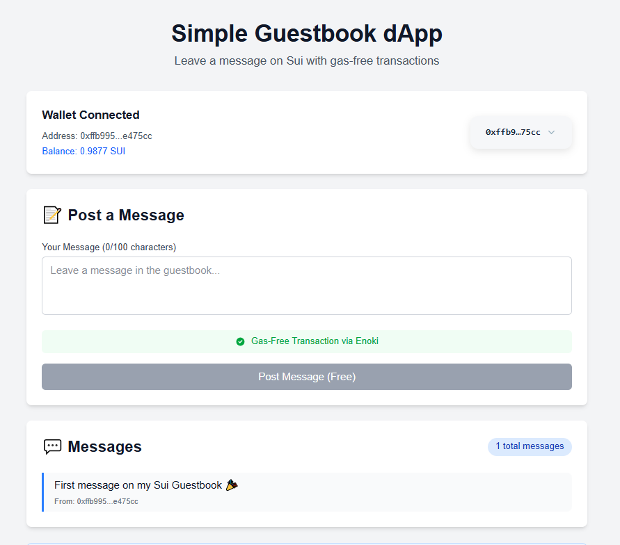
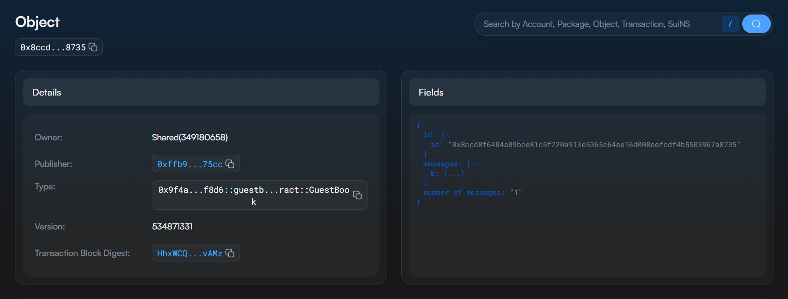

# 💻 Guestbook dApp Frontend (Next.js + Enoki)

This folder contains the **frontend application** for the Guestbook dApp.  
It is built with **Next.js** and integrates with the Move smart contract deployed on the **Sui blockchain**.  
Transactions are sponsored by **Enoki**, so users can post messages **gas-free**.

---

## 🛠️ Features

- ✍️ Post messages up to 100 characters.
- 💾 Messages are stored permanently on the Sui blockchain.
- ⛽ Gas-free transactions via Enoki sponsored transactions.
- 🌐 User-friendly Next.js interface.

---

## ⚙️ Prerequisites

- [Node.js 18+](https://nodejs.org/)
- Backend contract deployed (see [guestbook_contract](../guestbook_contract/README.md))
- Package ID & GuestBook Object ID from contract publish
- Enoki account & Secret Key → [Enoki Docs](https://docs.sui.io/tools/enoki)

---

## 🔹 Setup

1. Edit `.env.local` with your contract and Enoki values:

```ini
NEXT_PUBLIC_PACKAGE_ID=<YOUR_PACKAGE_ID>
NEXT_PUBLIC_GUESTBOOK_ID=<YOUR_GUESTBOOK_OBJECT_ID>
ENOKI_SECRET_KEY=<YOUR_ENOKI_SECRET_KEY>
```

2. Install dependencies:

```bash
npm install
```

3. Run development server:

```bash
npm run dev
```

App will be available at → [http://localhost:3000](http://localhost:3000)

---

## ✨ Usage

- Open the dApp in your browser.
- Type a message (max 100 chars).
- Click **Post Message (Free)**.
- Message is posted on-chain (gas-free).



---

## 🔎 Verify On-Chain

After posting, you can confirm message storage:

```bash
sui client object <GUESTBOOK_OBJECT_ID>
```



---

## 📚 Resources
- [Next.js](https://nextjs.org/)
- [Sui dApp Kit](https://docs.sui.io/guides/developer/dapp-kit)
- [Enoki Sponsored Transactions](https://docs.sui.io/tools/enoki)
